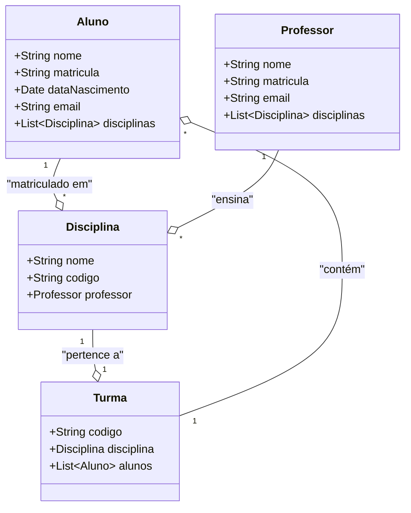

## Diagrama de Classes

```mermaid
classDiagram
    class Aluno {
        +String nome
        +String matricula
        +Date dataNascimento
        +String email
        +List~Disciplina~ disciplinas
    }

    class Disciplina {
        +String nome
        +String codigo
        +Professor professor
    }

    class Professor {
        +String nome
        +String matricula
        +String email
        +List~Disciplina~ disciplinas
    }

    class Turma {
        +String codigo
        +Disciplina disciplina
        +List~Aluno~ alunos

    }

    Aluno "1" --o "*" Disciplina : "matriculado em"
    Professor "1" --o "*" Disciplina : "ensina"
    Disciplina "1" --o "1" Turma : "pertence a"
    Turma "1" --o "*" Aluno : "contém"
```
